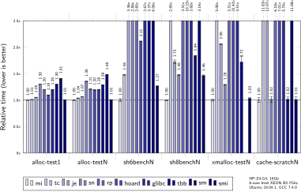

# Mimalloc-bench

&nbsp;

Suite for benchmarking malloc implementations, originally
developed for benchmarking [`mimalloc`](https://github.com/microsoft/mimalloc).
Collection of various benchmarks from the academic literature, together with
automated scripts to pull specific versions of benchmark programs and
allocators from Github and build them.

Due to the large variance in programs and allocators, the suite is currently
only developed for Unix-like systems, and specifically Ubuntu with `apt-get`, Fedora with `dnf`,
and macOS (for a limited set of allocators and benchmarks).
The only system-installed allocator used is glibc's implementation that ships as part of Linux's libc.
All other allocators are downloaded and built as part of `build-bench-env.sh` --
if you are looking to run these benchmarks on a different Linux distribution look at
the `setup_packages` function to see the packages required to build the full set of
allocators.


It is quite easy to add new benchmarks and allocator implementations --
please do so!.

Enjoy,
  Daan


Note that all the code in the `bench` directory is not part of
_mimalloc-bench_ as such, and all programs in the `bench` directory are
governed under their own specific licenses and copyrights as detailed in
their `README.md` (or `license.txt`) files. They are just included here for convenience.


# Benchmarking

The `build-bench-env.sh` script with the `all` argument will automatically pull
all needed benchmarks and allocators and build them in the `extern` directory:
```
~/dev/mimalloc-bench> ./build-bench-env.sh all
```
It starts installing packages and you will need to enter the sudo password.
All other programs are build in the `mimalloc-bench/extern` directory.
Use `./build-bench-env.sh -h` to see all options.

If everything succeeded, you can run the full benchmark suite (from `out/bench`) as:

- `~/dev/mimalloc-bench> cd out/bench`
- `~/dev/mimalloc-bench/out/bench>../../bench.sh alla allt`

Or just test _mimalloc_ and _tcmalloc_ on _cfrac_ and _larson_ with 16 threads:

- `~/dev/mimalloc-bench/out/bench>../../bench.sh --procs=16 mi tc cfrac larson`

Generally, you can specify the allocators (`mi`, `je`,
`tc`, `hd`, `sys` (system allocator)) etc, and the benchmarks
, `cfrac`, `espresso`, `barnes`, `lean`, `larson`, `alloc-test`, `cscratch`, etc.
Or all allocators (`alla`) and tests (`allt`).
Use `--procs=<n>` to set the concurrency, and use `--help` to see all supported
allocators and benchmarks.


## Current Allocators

Supported allocators are as follow, see
[build-bench-env.sh](https://github.com/daanx/mimalloc-bench/blob/master/build-bench-env.sh)
for the versions:

- **dieharder**: The [_DieHarder_](https://github.com/emeryberger/DieHard)
  allocator is an error-resistant memory allocator for Windows, Linux, and Mac
  OS X.
- **ff**: [ffmalloc](https://github.com/bwickman97/ffmalloc), from the Usenix
  Security 21 [paper](https://www.usenix.org/conference/usenixsecurity21/presentation/wickman)
- **gd**: The [_Guarder_](https://github.com/UTSASRG/Guarder) allocator
  is a tunable secure allocator by the UTSA.
- **hd**: The [_Hoard_](https://github.com/emeryberger/Hoard) allocator by
  Emery Berger \[1]. This is one of the first multi-thread scalable allocators.
- **hm**: The [_Hardened
  Malloc_](https://github.com/GrapheneOS/hardened_malloc) from GrapheneOS,
  security-focused.
- **iso**: The [_Isoalloc_](https://github.com/struct/isoalloc/) allocator,
  isolation-based aiming at providing a reasonable level of security without
  sacrificing too much the performances.
- **je**: The [_jemalloc_](https://github.com/jemalloc/jemalloc)
  allocator by [Jason Evans](https://github.com/jasone),
  now developed at Facebook
  and widely used in practice, for example in FreeBSD and Firefox.
- **lp**: The [_libpas_](https://github.com/WebKit/WebKit/tree/main/Source/bmalloc/libpas)
  allocator, used by [WebKit](https://webkit.org).
- **mng**: [musl](https://musl.libc.org)'s memory allocator.
- **mesh**: The [_mesh_](https://github.com/plasma-umass/mesh) allocator, a
  memory allocator that automatically reduces the memory footprint of C/C++
  applications. Also tested as **nomesh** with the meshing feature disabled.
- **mi**: The [_mimalloc_](https://github.com/microsoft/mimalloc) allocator.
  We can also test the debug version as **dmi** (this can be used to check for
  any bugs in the benchmarks), and the secure version as **smi**.
- **rp**: The [_rpmalloc_](https://github.com/mjansson/rpmalloc) allocator uses
  16-byte aligned allocations and is developed by [Mattias
  Jansson](https://twitter.com/maniccoder) at Epic Games, used for example
  in [Haiku](https://git.haiku-os.org/haiku/commit/?id=7132b79eafd69cced14f028f227936b9eca4de48).
- **sc**: The [_scalloc_](https://github.com/cksystemsgroup/scalloc) allocator,
  a fast, multicore-scalable, low-fragmentation memory allocator 
- **scudo**: The
  [_scudo_](https://www.llvm.org/docs/ScudoHardenedAllocator.html) allocator
  used by Fuschia and Android.
- **sg**: The [slimguard](https://github.com/ssrg-vt/SlimGuard) allocator,
  designed to be secure and memory-efficient.
- **sm**: The [_Supermalloc_](https://github.com/kuszmaul/SuperMalloc)
  allocator by Bradley Kuszmaul uses hardware transactional memory to speed up
  parallel operations.
- **sn**: The [_snmalloc_](https://github.com/microsoft/snmalloc) allocator
  is a recent concurrent message passing
  allocator by Liétar et al. \[8].
- **tbb**: The Intel [TBB](https://github.com/intel/tbb) allocator that comes
  with the Thread Building Blocks (TBB) library \[7].
- **tc**: The [_tcmalloc_](https://github.com/gperftools/gperftools)
  allocator which comes as part of the Google performance tools,
  now maintained by the commuity.
- **tcg**: The [_tcmalloc_](https://github.com/google/tcmalloc)
  allocator, maintained and [used](https://cloud.google.com/blog/topics/systems/trading-off-malloc-costs-and-fleet-efficiency)
  by Google.
- **sys**: The system allocator. Here we usually use the _glibc_ allocator
  (which is originally based on _Ptmalloc2_).


## Current Benchmarks

The first set of benchmarks are real world programs, or are trying to mimic
some, and consists of:

- __barnes__: a hierarchical n-body particle solver \[4], simulating the
  gravitational forces between 163840 particles. It uses relatively few
  allocations compared to `cfrac` and `espresso` but is multithreaded.
- __cfrac__: by Dave Barrett, implementation of continued fraction
  factorization, using many small short-lived allocations.
- __espresso__: a programmable logic array analyzer, described by
  Grunwald, Zorn, and Henderson \[3]. in the context of cache aware memory allocation.
- __gs__: have [ghostscript](https://www.ghostscript.com) process the entire
  Intel Software Developer’s Manual PDF, which is around 5000 pages.
- __leanN__:  The [Lean](https://github.com/leanprover/lean) compiler by
  de Moura _et al_, version 3.4.1,
  compiling its own standard library concurrently using N threads
  (`./lean --make -j N`). Big real-world workload with intensive
  allocations.
- __redis__: running [redis-benchmark](https://redis.io/topics/benchmarks),
  with 1 million requests pushing 10 new list elements and then requesting the
  head 10 elements, and measures the requests handled per second. Simulates a
  real-world workload.
- __larsonN__: by Larson and Krishnan \[2]. Simulates a server workload using 100 separate
   threads which each allocate and free many objects but leave some
   objects to be freed by other threads. Larson and Krishnan observe this
   behavior (which they call _bleeding_) in actual server applications,
   and the benchmark simulates this.
- __larsonN-sized__: same as the __larsonN__ except it uses sized deallocation calls which
   have a fast path in some allocators. 
- __lua__: compiling the [lua interpreter](https://github.com/lua/lua).
- __z3__: perform some computations in [z3](https://github.com/Z3Prover/z3).

The second set of benchmarks are stress tests and consist of:

- __alloc-test__: a modern allocator test developed by
  OLogN Technologies AG ([ITHare.com](http://ithare.com/testing-memory-allocators-ptmalloc2-tcmalloc-hoard-jemalloc-while-trying-to-simulate-real-world-loads/))
  Simulates intensive allocation workloads with a Pareto size
  distribution. The _alloc-testN_ benchmark runs on N cores doing
  100·10⁶ allocations per thread with objects up to 1KiB
  in size. Using commit `94f6cb`
  ([master](https://github.com/node-dot-cpp/alloc-test), 2018-07-04)
- __cache-scratch__: by Emery Berger \[1]. Introduced with the
  [Hoard](https://github.com/emeryberger/Hoard) allocator to test for
  _passive-false_ sharing of cache lines: first some small objects are
  allocated and given to each thread; the threads free that object and allocate
  immediately another one, and access that repeatedly. If an allocator
  allocates objects from different threads close to each other this will lead
  to cache-line contention.
- __cache_trash__: part of [Hoard](https://github.com/emeryberger/Hoard)
  benchmarking suite, designed to exercise heap cache locality.
- __glibc-simple__ and __glibc-thread__: benchmarks for the [glibc](https://github.com/bminor/glibc/tree/master/benchtests).
- __malloc-large__: part of mimalloc benchmarking suite, designed
  to exercice large (several MiB) allocations.
- __mleak__: check that terminate threads don't "leak" memory.
- __rptest__: modified version of the [rpmalloc-benchmark](https://github.com/mjansson/rpmalloc-benchmark) suite.
- __mstress__: simulates real-world server-like allocation patterns, using N threads with with allocations in powers of 2  
  where objects can migrate between threads and some have long life times. Not all threads have equal workloads and 
  after each phase all threads are destroyed and new threads created where some objects survive between phases.
- __rbstress__: modified version of [allocator_bench](https://github.com/SamSaffron/allocator_bench),
  allocates chunks in memory via ruby shenanigans.
- __sh6bench__: by [MicroQuill](http://www.microquill.com) as part of
  [SmartHeap](http://www.microquill.com/smartheap/sh_tspec.htm). Stress test
  where some of the objects are freed in a usual last-allocated, first-freed
  (LIFO) order, but others are freed in reverse order. Using the public
  [source](http://www.microquill.com/smartheap/shbench/bench.zip) (retrieved
  2019-01-02)
- __sh8benchN__: by [MicroQuill](http://www.microquill.com) as part of
  [SmartHeap](http://www.microquill.com/smartheap/sh_tspec.htm). Stress test
  for multi-threaded allocation (with N threads) where, just as in _larson_,
  some objects are freed by other threads, and some objects freed in reverse
  (as in _sh6bench_). Using the public
  [source](http://www.microquill.com/smartheap/SH8BENCH.zip) (retrieved
  2019-01-02)
- __xmalloc-testN__: by Lever and Boreham \[5] and Christian Eder. We use the
  updated version from the
  [SuperMalloc](https://github.com/kuszmaul/SuperMalloc) repository. This is a
  more extreme version of the _larson_ benchmark with 100 purely allocating
  threads, and 100 purely deallocating threads with objects of various sizes
  migrating between them. This asymmetric producer/consumer pattern is usually
  difficult to handle by allocators with thread-local caches.

Finally, there is a
[security benchmark](https://github.com/daanx/mimalloc-bench/tree/master/bench/security)
aiming at checking basic security properties of allocators.

## Example

Below is an example (Apr 2019) of the benchmark results on an HP
Z4-G4 workstation with a 4-core Intel® Xeon® W2123 at 3.6 GHz with 16GB
ECC memory, running Ubuntu 18.04.1 with LibC 2.27 and GCC 7.3.0.




Memory usage:


(note: the _xmalloc-testN_ memory usage should be disregarded is it
allocates more the faster the program runs. Unfortunately,
there are no entries for _SuperMalloc_ in the _leanN_ and _xmalloc-testN_
benchmarks as it faulted on those)

# Resulting improvements and found issues

- [Minor performances improvement](https://github.com/struct/isoalloc/commit/049c12e4c2ad5c21a768f7f3873d84bf1106646a) in isoalloc
- A [crash]( https://github.com/struct/isoalloc/issues/56 ) in isoalloc
- Caught a [compilation issue](https://github.com/mjansson/rpmalloc/issues/263) in rpmalloc
- [Parallel compilation](https://github.com/emeryberger/DieHard/issues/15) support in DieHarder
- [Portability improvement](https://github.com/oneapi-src/oneTBB/pull/764) in Intel TBB malloc
- [Various](https://github.com/google/tcmalloc/issues/155) [portability](https://github.com/google/tcmalloc/issues/128) [improvements]( https://github.com/google/tcmalloc/issues/125 ) in Google's tcmalloc
- [Improved double-free detection]( https://github.com/microsoft/snmalloc/pull/550 ) in snmalloc
- [Fixed compilation on modern glibc]( https://github.com/ssrg-vt/SlimGuard/pull/13 ) in SlimGuard
- [Portability issues](https://github.com/mjansson/rpmalloc/issues/293) in rpmalloc
- Provided [data]( https://gitlab.gnome.org/GNOME/glib/-/issues/1079#note_1627978 ) for the glib allocator.

# References

- \[1] Emery D. Berger, Kathryn S. McKinley, Robert D. Blumofe, and Paul R. Wilson.
   _Hoard: A Scalable Memory Allocator for Multithreaded Applications_
   the Ninth International Conference on Architectural Support for Programming Languages and Operating Systems (ASPLOS-IX). Cambridge, MA, November 2000.
   [pdf](http://www.cs.utexas.edu/users/mckinley/papers/asplos-2000.pdf)


- \[2] P. Larson and M. Krishnan. _Memory allocation for long-running server applications_. In ISMM, Vancouver, B.C., Canada, 1998.
      [pdf](http://citeseemi.ist.psu.edu/viewdoc/download;jsessionid=5F0BFB4F57832AEB6C11BF8257271088?doi=10.1.1.45.1947&rep=rep1&type=pdf)

- \[3] D. Grunwald, B. Zorn, and R. Henderson.
  _Improving the cache locality of memory allocation_. In R. Cartwright, editor,
  Proceedings of the Conference on Programming Language Design and Implementation, pages 177–186, New York, NY, USA, June 1993.
  [pdf](http://citeseemi.ist.psu.edu/viewdoc/download?doi=10.1.1.43.6621&rep=rep1&type=pdf)

- \[4] J. Barnes and P. Hut. _A hierarchical O(n*log(n)) force-calculation algorithm_. Nature, 324:446-449, 1986.

- \[5] C. Lever, and D. Boreham. _Malloc() Performance in a Multithreaded Linux Environment._
  In USENIX Annual Technical Conference, Freenix Session. San Diego, CA. Jun. 2000.
  Available at <https://​github.​com/​kuszmaul/​SuperMalloc/​tree/​master/​tests>

- \[6] Timothy Crundal. _Reducing Active-False Sharing in TCMalloc._
   2016. <http://​courses.​cecs.​anu.​edu.​au/​courses/​CSPROJECTS/​16S1/​Reports/​Timothy*​Crundal*​Report.​pdf>. CS16S1 project at the Australian National University.

- \[7] Alexey Kukanov, and Michael J Voss.
   _The Foundations for Scalable Multi-Core Software in Intel Threading Building Blocks._
   Intel Technology Journal 11 (4). 2007

- \[8] Paul Liétar, Theodore Butler, Sylvan Clebsch, Sophia Drossopoulou, Juliana Franco, Matthew J Parkinson,
  Alex Shamis, Christoph M Wintersteiger, and David Chisnall.
  _Snmalloc: A Message Passing Allocator._
  In Proceedings of the 2019 ACM SIGPLAN International Symposium on Memory Management, 122–135. ACM. 2019.
